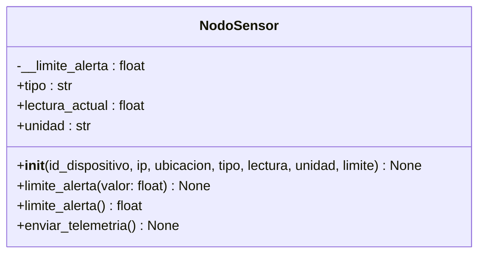

```mermaid
classDiagram
    class NodoSensor {
        -__limite_alerta : float
        +tipo : str
        +lectura_actual : float
        +unidad : str
        +__init__(id_dispositivo, ip, ubicacion, tipo, lectura, unidad, limite) None
        +limite_alerta(valor: float) None
        +limite_alerta() float
        +enviar_telemetria() None
    }
```