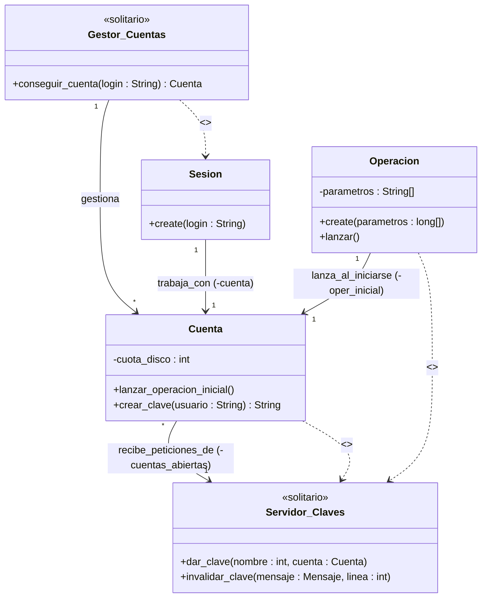

```mermaid
classDiagram
    class Gestor_Cuentas {
        <<solitario>>
        +conseguir_cuenta(login : String) Cuenta
    }
    
    class Sesion {
        +create(login : String)
    }
    
    class Operacion {
        -parametros : String[]
        +create(parametros : long[])
        +lanzar()
    }
    
    class Cuenta {
        -cuota_disco : int
        +lanzar_operacion_inicial()
        +crear_clave(usuario : String) String
    }
    
    class Servidor_Claves {
        <<solitario>>
        +dar_clave(nombre : int, cuenta : Cuenta)
        +invalidar_clave(mensaje : Mensaje, linea : int)
    }

    Gestor_Cuentas "1" --> "*" Cuenta : gestiona
    Gestor_Cuentas ..> Sesion : <<solitario>>
    Sesion "1" --> "1" Cuenta : trabaja_con (-cuenta)
    Operacion "1" --> "1" Cuenta : lanza_al_iniciarse (-oper_inicial)
    Cuenta "*" --> "1" Servidor_Claves : recibe_peticiones_de (-cuentas_abiertas)
    Cuenta ..> Servidor_Claves : <<solitario>>
    Operacion ..> Servidor_Claves : <<local>>
```